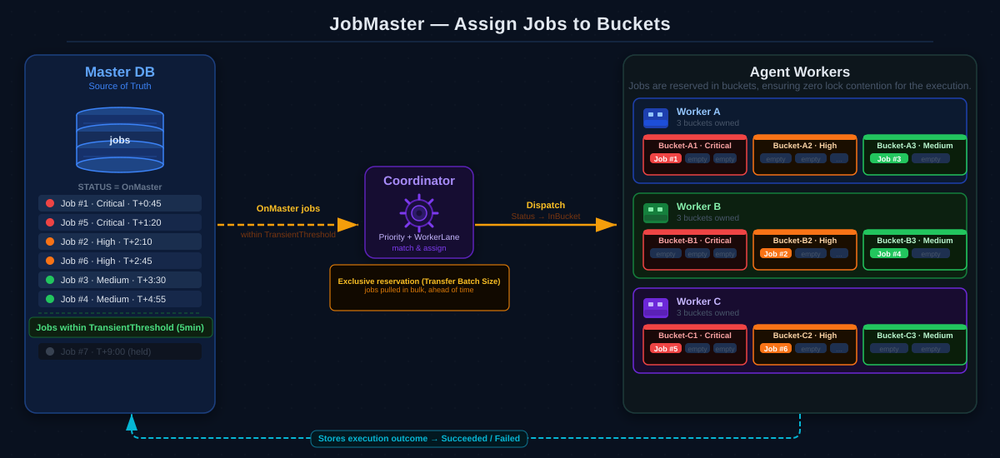
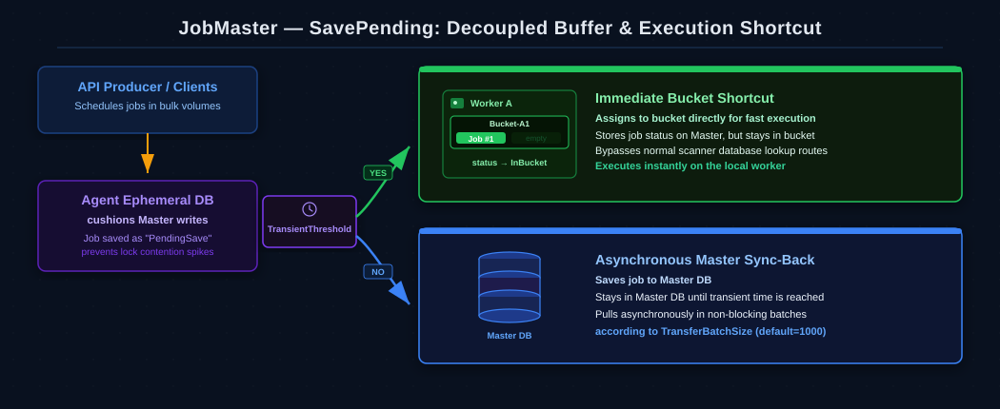

# JobMaster — Core Architecture Overview

Welcome to the **JobMaster** architecture overview.

JobMaster is a distributed background task orchestration engine for .NET designed to manage background task execution with a focus on background process auditing (making debugging and manual/historical executions easy), horizontal scaling, and flexible configuration to let developers tune the system to their specific needs.

---

## 1. Core Architectural Mission

The core design goals of JobMaster are:
1. **Auditing & Troubleshooting**: Providing a detailed background execution audit trail of every job to facilitate debugging and support manual/historical re-executions.
2. **Horizontal Scale**: Allowing execution workers to scale horizontally without placing a transaction or lock bottleneck on the central orchestration storage.
3. **Architectural Flexibility**: Enabling developers to tune the engine's parameters (coordinators, workers, lanes, and buffers) in the exact way that fits their specific business needs.

---

## 2. Decoupled Storage: Orchestration & Durable Storage vs. Transport Layer

Rather than running a monolithic background queue where workers constantly poll a central database table, JobMaster separates tasks into permanent orchestration storage and a transient transport layer:

* **Orchestration & Durable Storage (Master DB)**:
  * **Role**: Permanent source of truth for topology, policies, active worker registration, and final job execution audit logs.
  * **Characteristics**: Low-churn, highly indexed, optimized for sequential writes. It supports standard relational databases (PostgreSQL, SQL Server, MySQL) and is designed to support other database backends in the future.
* **The Transport Layer (Agent Ephemeral Storage / Message Broker)**:
  * **Role**: High-speed, transient buffering for in-flight tasks using PostgreSQL, SQL Server, MySQL, or NATS JetStream.
  * **Characteristics**: Ephemeral (only stores active/in-flight jobs), optimized for high-speed writes and fast Master-agnostic execution.

### Multi-Transport Scaling
JobMaster allows you to **scale across multiple different transport layers simultaneously** to perfectly isolate different workloads. For example:
* Route high-velocity, lightweight jobs (e.g., real-time webhooks, emails) to a high-speed **NATS JetStream** transport layer.
* Route long-running, resource-intensive analytics tasks to an **RDBMS** transport layer (e.g. PostgreSQL or SQL Server).

### Decoupled Architecture Diagram
Here is how JobMaster decouples coordination (brains) from execution (muscle), separating operational responsibilities into independent planes to optimize scale and avoid database write constraints:

---

## 3. Standard Flow: Assigning Jobs to Buckets

The standard execution flow partitions workload queues so that multiple workers can process jobs in parallel, reducing lock contention bottlenecks.

### The Assignment Flow Step-by-Step:
1. **Durable Jobs**: Jobs scheduled in the future reside in the Master DB in a `HeldOnMaster` status.
2. **The Transient Threshold**: The **Coordinator** scans the Master DB for jobs whose next execution falls within the `TransientThreshold` (e.g., the next 10 minutes).
3. **Exclusive Bulk Reservation**: The Coordinator pulls these jobs in bulk according to the `TransferBatchSize` and assigns them to **Buckets** owned by active workers.
4. **Bucket Partitioning**: Workers take atomic ownership of buckets. Each worker processes only the jobs inside its owned buckets, reducing cross-worker queue collisions.
5. **Execution & Sync-Back**: Worker threads execute the handlers and sync the final execution outcome (Succeeded/Failed) back to the Master DB, providing a full audit trail for easy debugging.

### Standard Flow Diagram
Here is how jobs flow from the Master DB through the Coordinator and into the Worker Buckets:

---

## 4. High-Speed Intake Flow: The SavePending Buffer & Execution Bypass

To avoid overloading the Master DB during high-volume bursts (e.g., an API receiving millions of rapid scheduling requests), JobMaster can write scheduled tasks directly into the transport layer, allowing immediate execution shortcuts.

### The SavePending Flow Step-by-Step:
1. **Fast Buffer Write**: When a client schedules a job, the API bypasses the Master DB and writes the task directly to the **Agent Ephemeral Transport** in milliseconds (or even faster, depending on the transport technology, such as RDBMS versus memory-based message brokers like NATS).
2. **The Decision Check**: The write buffer immediately evaluates the job's planned start time against the **TransientThreshold**:
   * **YES Path (Immediate Execution Bypass)**: If the job is due immediately, **it still stores the job record on the Master DB (ensuring a complete audit trail)**, but it bypasses the normal background scanning/polling lookup routes to route execution instantly to the active worker bucket (`status → InBucket`) for fast execution.
   * **NO Path (Asynchronous Sync-Back)**: If the job is scheduled for a future time, a background runner pulls these buffered jobs in non-blocking batches according to the `TransferBatchSize` (default=1000) and flushes them into the Master DB.

### SavePending Flow Diagram
Here is how the API producer schedules jobs and how they are routed based on their planned execution time:

---

## 5. Self-Healing & Orphan Recovery (The Lost Bucket Rescue)

If an **Agent Worker** crashes, stops heartbeating, or loses network connectivity unexpectedly, JobMaster's self-healing loop recovers the orphaned work automatically without losing a single job.

### The Recovery Flow Step-by-Step:
1. **Heartbeat Failure**: A worker crashes. The cluster coordinator detects the missing heartbeat and marks the worker's assigned buckets as **`Lost`**.
2. **Adoption**: A healthy active worker claims ownership of the `Lost` bucket, moving its status to **`Draining`**.
3. **Redirection to Master**: The adopting worker pulls all **unfinished jobs** (currently active in the execution queue) and flushes all **unsaved jobs** (buffered under `SavePending` status but not yet stored in the orchestration database) out of the `Draining` bucket and **redirects them back to the Master DB** (setting their status back to `HeldOnMaster`).
4. **Re-Assignment**: Once redirected, the jobs are cleanly picked up by active, healthy buckets on other workers during standard Coordinator scans.

### Self-Healing & Orphan Recovery Diagram
Here is how the active worker adopts the lost bucket and redirects both unfinished and unsaved jobs back to the Master DB:

---

## 6. Key Architectural Design Choices

* **Partitioning via Buckets**: Instead of pulling individual rows, workers own entire buckets. This design minimizes locking overhead and reduces queue collision bottlenecks.
* **Decoupled Coordination & Execution**: Coordinators handle Master DB queries and onboarding. Executors only talk to the fast Agent transport, allowing you to scale compute horizontally with minimal impact on Master DB capacity.
* **Workload Isolation (Lanes)**: Logical isolation lanes (`WorkerLane`) allow you to separate slow, resource-heavy compute tasks from latency-critical transactional jobs.

---

## 7. Next Steps

Now that you understand the architectural concepts, you are ready to configure and scale your cluster:

1. **Architecture & Performance Tuning Guide**: Learn how to configure your Coordinators, Executors, and Buckets to scale for any workload.
   * See: [Architecture & Performance Tuning Guide](ArchitectureTuningGuide.md)
2. **Configuration References**:
   * [Buckets & Concurrency Configuration](BucketsConfiguration.md)
   * [Workers & Lanes Configuration](WorkersConfiguration.md)
   * [Agent Connections Configuration](AgentsConfiguration.md)
