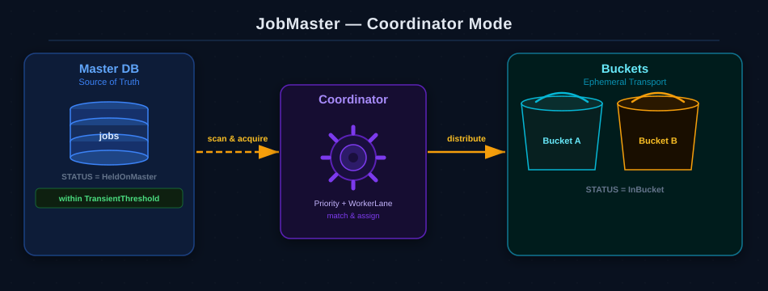
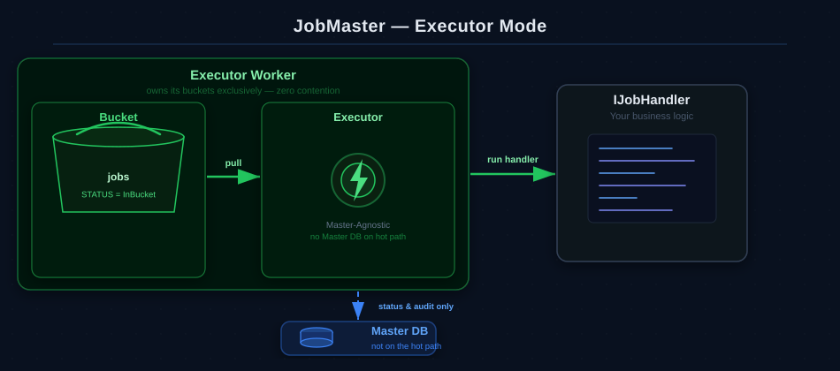
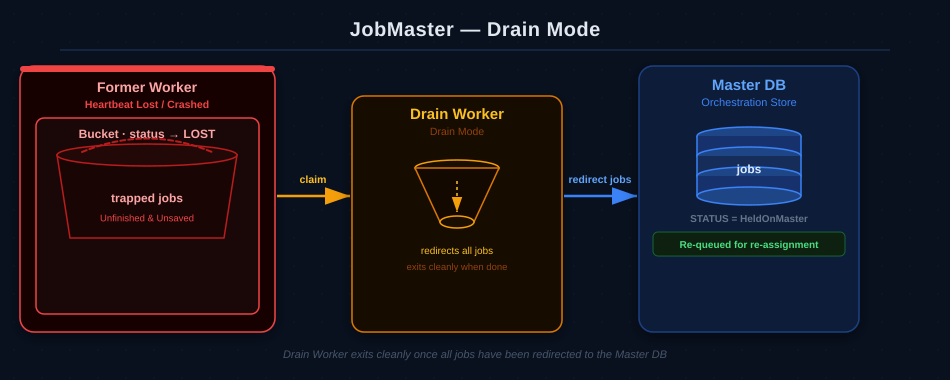

# JobMaster — Core Architecture Overview

Welcome to the **JobMaster** architecture overview.

JobMaster is a distributed background task orchestration engine for .NET designed to manage background task execution with a focus on background process auditing (making debugging and manual/historical executions easy), horizontal scaling, and flexible configuration to let developers tune the system to their specific needs.

---

## 1. Core Architectural Mission

The core design goals of JobMaster are:
1. **Auditing & Troubleshooting**: Providing a detailed background execution audit trail of every job to facilitate debugging and support manual/historical re-executions.
2. **Horizontal Scale**: Allowing execution workers to scale horizontally without placing a transaction or lock bottleneck on the central orchestration storage.
3. **Architectural Flexibility**: Enabling developers to tune the engine's parameters (coordinators, workers, lanes, and buffers) in the exact way that fits their specific business needs.

---

## 2. Standard Flow: Assigning Jobs to Buckets

The standard execution flow partitions workload queues so that multiple workers can process jobs in parallel, reducing lock contention bottlenecks.

### The Assignment Flow Step-by-Step:
1. **Durable Jobs**: Jobs scheduled in the future reside in the Master DB in a `HeldOnMaster` status.
2. **The Transient Threshold**: The **Coordinator** scans the Master DB for jobs whose next execution falls within the `TransientThreshold` (e.g., the next 5 minutes).
3. **Exclusive Bulk Reservation**: The Coordinator pulls these jobs in bulk according to the `TransferBatchSize` and assigns them to **Buckets** owned by active workers.
4. **Bucket Partitioning**: Workers take atomic ownership of buckets. Each worker processes only the jobs inside its owned buckets, reducing cross-worker queue collisions.
5. **Execution & Sync-Back**: Worker threads execute the handlers and sync the final execution outcome (Succeeded/Failed) back to the Master DB, providing a full audit trail for easy debugging.

### Standard Flow Diagram
Here is how jobs flow from the Master DB through the Coordinator and into the Worker Buckets:

---

## 3. High-Speed Intake Flow: The SavePending Buffer & Execution Bypass

To avoid overloading the Master DB during high-volume bursts (e.g., an API receiving millions of rapid scheduling requests), JobMaster writes scheduled tasks directly into the transport layer and defers Master DB interaction to background runners. **The caller does not wait for a Master DB write** — the API response completes as soon as the ephemeral transport write succeeds.

### The SavePending Flow Step-by-Step:
1. **Fast Buffer Write**: When a client schedules a job, the API bypasses the Master DB entirely and writes the task directly to the **Agent Ephemeral Transport** in milliseconds (or even faster, depending on the transport technology, such as RDBMS versus memory-based message brokers like NATS). The API call returns immediately after this write — the Master DB is not touched on the hot path.
2. **Background Decision Check**: A background runner picks up the buffered job and evaluates its planned start time against the **TransientThreshold**. Because this check runs off the hot path, the Master DB is only written to by background processes — preserving low-latency API responses under any load:
   * **YES Path (Immediate Execution Bypass)**: If the job is due immediately, the background runner **writes the job record to the Master DB** (ensuring a full audit trail) and routes execution directly to the active worker bucket (`status → InBucket`), bypassing the normal scanning/polling queues for fast dispatch.
   * **NO Path (Asynchronous Sync-Back)**: If the job is scheduled for a future time, the background runner flushes it into the Master DB in non-blocking batches according to the `TransferBatchSize` (default=1000), where it waits as `HeldOnMaster` until the Coordinator picks it up.

### SavePending Flow Diagram
Here is how the API producer schedules jobs and how they are routed based on their planned execution time:

---

## 4. Self-Healing & Orphan Recovery (The Lost Bucket Rescue)

If an **Agent Worker** crashes, stops heartbeating, or loses network connectivity unexpectedly, JobMaster's self-healing loop recovers the orphaned work automatically without losing a single job.

### The Recovery Flow Step-by-Step:
1. **Heartbeat Failure**: A worker crashes. The cluster coordinator detects the missing heartbeat and marks the worker's assigned buckets as **`Lost`**.
2. **Adoption**: A healthy active worker claims ownership of the `Lost` bucket, moving its status to **`Draining`**.
3. **Redirection to Master**: The adopting worker pulls all **unfinished jobs** (currently active in the execution queue) and flushes all **unsaved jobs** (buffered under `SavePending` status but not yet stored in the orchestration database) out of the `Draining` bucket and **redirects them back to the Master DB** (setting their status back to `HeldOnMaster`).
4. **Re-Assignment**: Once redirected, the jobs are cleanly picked up by active, healthy buckets on other workers during standard Coordinator scans.

### Self-Healing & Orphan Recovery Diagram
Here is how the active worker adopts the lost bucket and redirects both unfinished and unsaved jobs back to the Master DB:

---

## 5. Key Architectural Design Choices

* **Partitioning via Buckets**: Instead of pulling individual rows, workers own entire buckets. This design minimizes locking overhead and reduces queue collision bottlenecks.
* **Decoupled Coordination & Execution**: Coordinators handle Master DB queries and onboarding. Executors only talk to the fast Agent transport, allowing you to scale compute horizontally with minimal impact on Master DB capacity.
* **Workload Isolation (Lanes)**: Logical isolation lanes (`WorkerLane`) allow you to separate slow, resource-heavy compute tasks from latency-critical transactional jobs.

---

## 6. Workers

Workers run entirely as background processes and carry three distinct responsibilities: coordinating job onboarding (**Coordinator**), executing handlers (**Executor**), and recovering orphaned buckets (**Drain**). In the default `Full` mode a single worker handles all three. For higher-scale deployments these roles can be decoupled — each worker process assigned exactly one responsibility — allowing each plane to be sized, tuned, and scaled independently.

---

### Coordinator Mode — The Brains
Scans the Master DB for pending work, acquires jobs in bulk, and distributes them into **Agent Buckets**. Also assigns orphaned buckets to available Drain workers for recovery. Does not execute handlers.

* **Resource Profile**: CPU-light, network/I/O-dense. Needs strong connectivity to the Master DB.
* **Benefit**: Because execution is fully isolated, Coordinators continue onboarding work on schedule even when executor nodes are at 100% CPU.

---

### Executor Mode — The Muscle
Pulls jobs from assigned **Agent Buckets** and runs your `IJobHandler` logic. Does not scan the Master DB for scheduling — it only writes status updates and enforces execution deadlines.

* **Resource Profile**: CPU/Memory-heavy. **Master-Agnostic** — these nodes interact purely with the fast Agent Ephemeral Transport on the hot path.
* **Benefit**: Horizontal scaling. You can grow the executor fleet without adding coordination load to the Master DB.

---

### Drain Mode — The Rescue
A dedicated recovery mode. When a worker crashes or loses connectivity, a Drain worker claims its orphaned buckets, redirects all unfinished and unsaved jobs back to the Master DB, and exits cleanly once draining is complete.

* **Resource Profile**: Lightweight and short-lived. Safe to terminate once draining completes.
* **Benefit**: Clean, loss-free recovery without disrupting the active Coordinator or Executor fleet.

---

### Full Mode (Default)
The all-in-one mode that combines Coordinator, Executor, and Drain into a single process. Recommended for most deployments — split into specialized modes only when scale demands it.

---

## 7. Next Steps

Now that you understand the architectural concepts, you are ready to configure and scale your cluster:

1. **Configuration References**:
   * [Buckets & Concurrency Configuration](BucketsConfiguration.md)
   * [Workers & Lanes Configuration](WorkersConfiguration.md)
   * [Agent Connections Configuration](AgentsConfiguration.md)
2. **Architecture & Performance Tuning Guide**: Once you are familiar with the settings, learn how to size your Coordinators, Executors, and Buckets for any workload.
   * See: [Architecture & Performance Tuning Guide](ArchitectureTuningGuide.md)
