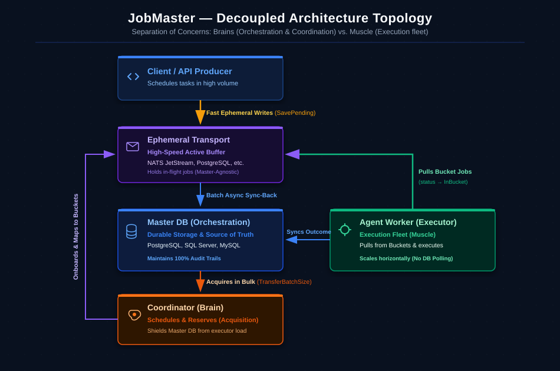
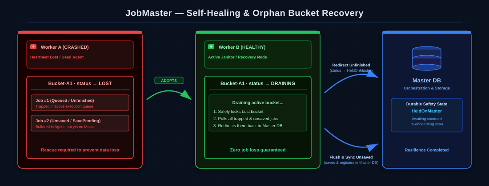

# JobMaster — Architecture & Performance Tuning Guide

Think of **JobMaster** not just as a library, but as a **distributed, highly tunable background task execution engine**.

Just as a modern storage engine has components you configure to balance read/write latency — partitions to reduce contention, read-ahead caches to eliminate fetch gaps, and replica pools for high availability — JobMaster has **Buckets** (contention partitioning), **Prefetch Buffers** (read-ahead caching), **Coordinators** (HA orchestration), **Workers**, and **Lanes** that you tune to your specific business requirements.

This guide provides the architectural blueprints and tuning formulas to help you confidently size your cluster, optimize throughput, isolate workloads, and shield your **Master DB** (Orchestration & Durable Storage) from contention.

---

## 1. Decoupling the Topology: Brains vs. Muscle

In a large-scale cluster, JobMaster separates operational responsibilities into independent, specialized modes. This decoupling ensures that database query bottlenecks never starve your compute resources, and heavy execution workloads never choke your orchestration plane.

### Decoupled Topology Diagram
Here is how JobMaster separates responsibilities into independent, specialized planes to scale compute horizontally without overloading the central database:



### Orchestration & Durable Storage (Master DB)
* **Role**: The source of truth for orchestration, topological health, policies, and detailed job execution audit trails to facilitate debugging and manual/historical executions.
* **Tuning Goal**: Keep hot-path read/write queries to a minimum.
* **How**: Jobs are scheduled here, but once execution begins, workers bypass polling the Master DB on the hot path.
* **Storage-Agnostic**: Fully supports standard relational databases (PostgreSQL, SQL Server, MySQL) and is designed to support other database backends in the future when reliable.

### The Brains (Coordinator Mode)
* **Role**: Polls the Master DB for pending work, acquires jobs in bulk, and distributes them into **Agent Buckets**.
* **Resource Profile**: CPU-light, network/I/O-dense. Needs strong connectivity to the Master DB.
* **Benefit**: Because compute execution is isolated, Coordinators can continue on-boarding work on time even if executor nodes are at 100% CPU.

### The Muscle (Executor Mode)
* **Role**: Pulls jobs from assigned **Agent Buckets** and runs your `IJobHandler` logic.
* **Resource Profile**: CPU/Memory-heavy. **Master-Agnostic**—these nodes do not poll or touch the Master DB on the hot path; they interact purely with the fast Agent Ephemeral Transport.
* **Benefit**: Horizontal scaling. You can scale your execution worker fleet horizontally without placing a lock contention bottleneck on your Master DB.

### Multi-Transport Workload Isolation
JobMaster allows you to **scale across multiple different transport layers simultaneously** to perfectly isolate different workloads. For example:
* Route high-velocity, lightweight jobs (e.g., real-time webhooks, emails) to a high-speed **NATS JetStream** transport layer.
* Route long-running, resource-intensive analytics tasks to an **RDBMS** transport layer (e.g. PostgreSQL or SQL Server).

---

## 2. Configuring and Tuning Cluster Settings: Sizing Your Configurations

When scaling your cluster, you have six major parameters to adjust. Here is how to toggle them to fit your workload:

### Parameter 1: How many Coordinators do I need?
Under normal conditions, **no more than 5 Coordinators** are enough for the entire cluster (using 2 or more provides active-passive High Availability / Failover).

* **Why**: A Coordinator's job is extremely fast. It queries, acquires, and pushes.
* **Tuning `TransferBatchSize`**: 
  * Default is `1000`.
  * For **high-throughput** scenarios (1000+ jobs/sec), increase this to `2000` or `5000`. This allows a single Coordinator sweep to onboard thousands of jobs in a single database round-trip, reducing write lock duration.
  * For **low-throughput, heavy-compute** scenarios, keep this at `100`–`500` to prevent over-allocating large chunks of work to single buckets.

---

### Parameter 2: How many Buckets do I need (`BucketQtyConfig`)?
Buckets are the fundamental unit of concurrency partitioning. They act like **logical storage partitions**. When a worker owns a bucket, it takes exclusive claim over all jobs inside it, reducing lock contention across workers.

* **Low Bucket Quantity (1–2 per priority)**:
  * **When to use**: Heavy, resource-intensive, long-running jobs (e.g., video encoding, report generation).
  * **Why**: Keeps the worker focused. Prevents fetching too much concurrent work, reducing CPU context switching and memory spikes.
* **High Bucket Quantity (5–20+ per priority)**:
  * **When to use**: High-velocity, lightweight, sub-second jobs (e.g., transactional webhooks, data ingestion, event alerts).
  * **Why**: Maximizes parallel intake. Multiple workers can pull from different buckets concurrently without waiting for each other.

> [!IMPORTANT]
> **The Sizing Rule of Thumb**:
> To ensure perfect load distribution, the **total number of active buckets** in a cluster lane should always be **equal to or greater than** the total number of active **Executor nodes** (`Total Buckets >= Total Executors`). If you have 10 workers and only 4 buckets, 6 workers will sit completely idle!

---

### Parameter 3: When should I create a separate Worker Lane (`WorkerLane`)?
Think of Lanes as **logically isolated queues** or dedicated execution zones. By default, all workers and jobs operate in the `Default` lane.

* **When to isolate**: Create a separate lane when you have a mixed workload of **Fast/Critical** jobs and **Slow/Heavy** jobs.
* **Why**: If they share a lane, long-running analytics jobs (taking 10 minutes each) will fill up all available bucket slots, causing high-priority transactional emails (taking 50ms) to starve in the queue.
* **Solution**: 
  * Dedicate a worker fleet to `.WorkerLane("Critical-Emails")` with many buckets.
  * Dedicate a separate, low-priority worker fleet on cheap instances to `.WorkerLane("Heavy-Analytics")` with few buckets.
* **Database vs. Message Broker Isolation for Long-Running Tasks**:
  * **Guidelines**: For jobs that take longer than 30 seconds to execute, prefer using a **database-backed transport layer** (RDBMS like PostgreSQL or SQL Server) rather than an ephemeral message broker (like NATS JetStream). 
  * **Why**: Message brokers are optimized for high-velocity, sub-second streaming. Directing long-running workloads through message broker channels can saturate dispatch/onboarding buffers and trigger consumer acknowledgement timeouts. A database-backed transport is designed to handle sustained, long-duration tasks gracefully and with full durability.
  * **Implementation**: Create a dedicated database agent connection, and configure a specialized worker pool using a dedicated `WorkerLane` connected to that database transport.
  
  ```csharp
  // Registering Isolated Broker vs. Database Transport Connections & Worker Fleets
  builder.Services.AddJobMasterCluster(config =>
  {
      config.ClusterId("SMB-Enterprise-Cluster");

      // 1. Register Connections
      // Fast Ephemeral Transport for real-time webhooks & emails
      config.AddAgentConnectionConfig("Fast-Broker-Connection")
          .UseNatsJetStream("nats://localhost:4222");

      // Durable Database-backed Transport for heavy/long analytics
      config.AddAgentConnectionConfig("Durable-Db-Connection")
          .UsePostgresForAgent("Host=localhost;Database=jobmaster_transport;...");
          
      // 2. Define Isolated Worker Fleets
      
      // Fleet A: Fast-Velocity Message Broker Workers (Pulls from NATS JetStream)
      config.AddWorker()
          .WorkerName("Broker-Executor")
          .SetWorkerMode(AgentWorkerMode.Execution)
          .AgentConnName("Fast-Broker-Connection") // Uses fast message broker
          .WorkerLane("Default") // Processes transactional, sub-second jobs
          .BucketQtyConfig(JobMasterPriority.Critical, 20)
          .ParallelismFactor(4.0); // Highly concurrent execution

      // Fleet B: Slow-Running RDBMS Workers (Pulls from Postgres Database Transport)
      config.AddWorker()
          .WorkerName("Long-Running-Executor")
          .SetWorkerMode(AgentWorkerMode.Execution)
          .AgentConnName("Durable-Db-Connection") // Connects to the database transport
          .WorkerLane("Slow-Analytics-Lane") // Dedicated lane for long executions (>30s)
          .BucketQtyConfig(JobMasterPriority.Medium, 1) // 1 bucket = Strict sequential order
          .ParallelismFactor(1.0) // Low concurrency per node to shield CPU
          .BucketBufferSize(5); // Prevents pre-fetching heavy tasks into memory
  });
  ```

---

### Parameter 4: Tuning Prefetch Buffers (`BucketBufferSize` & `BucketBufferLeadTime`)
To achieve fast dispatching, workers pre-fetch jobs from their assigned buckets into local memory. This is your cluster's **read-ahead cache**.

* **`BucketBufferSize` (Default: 250)**:
  * *High-Velocity Tuning*: If your handlers run in milliseconds, increase this to `500`–`1000`. This keeps the local worker's in-memory queue full, guaranteeing minimal delay between jobs.
  * *Heavy-Job Tuning*: If your handlers take minutes, lower this to `10`–`20` to prevent caching work in memory that might sit idle while other workers have free threads.
* **`BucketBufferLeadTime` (Default: 15s)**:
  * Defines how far ahead in time the worker scans the bucket to prefetch.
  * For high-velocity jobs, keep it short (`5s`–`15s`) to ensure high freshness. For slow, predictable schedules, you can increase this to `30s` to reduce network polling frequency.

---

### Parameter 5: Sizing Concurrency and Threads (`ParallelismFactor`)
The `ParallelismFactor` (Default: `1.0`) is a multiplier that scales the base number of concurrent execution slots assigned to a priority lane. It determines how many threads can execute tasks concurrently on a single worker node.

The framework computes the base running slots (capacity) based on job priority:
* **VeryLow**: 2 base slots
* **Low**: 3 base slots
* **Medium**: 4 base slots
* **High**: 5 base slots
* **Critical**: 6 base slots

The actual running capacity is calculated as:
$$\text{Run Capacity} = \text{Round}(\text{Base Slots} \times \text{ParallelismFactor})$$

Additionally, a local **Waiting Queue** is scaled to act as a buffer. Its capacity is always:
$$\text{Waiting Queue Capacity} = \text{Run Capacity} \times 5$$

#### Sizing Scenarios for `ParallelismFactor`:
* **Compute-Bound Tasks (CPU-Intense)**:
  * *Characteristics*: Video processing, image manipulation, cryptographic calculations, heavy PDF parsing.
  * *Tuning Strategy*: Keep the `ParallelismFactor` low (typically `0.25` to `1.0`). You want the total number of running tasks across all active buckets on the worker to closely align with (and not exceed) the physical CPU core count of the host container/VM.
  * *Why*: Having more execution threads than CPU cores causes CPU context switching thrashing, slowing down every task and increasing overall memory footprints.
* **I/O-Bound Tasks (Network & Storage Intense)**:
  * *Characteristics*: Sending emails, calling external webhooks/APIs, pulling/pushing file storage (e.g., AWS S3), or executing lightweight database queries.
  * *Tuning Strategy*: Scale the `ParallelismFactor` high (typically `2.0` to `5.0+`).
  * *Why*: Because your worker threads spend most of their time waiting for external networks or storage IO, the CPU remains largely idle. A higher factor allows you to process dozens or hundreds of concurrent requests in parallel on a single lightweight worker.

---

### Parameter 6: Sizing the Look-Ahead Window (`TransientThreshold`)
The `TransientThreshold` (Default: `10 minutes`) is a global cluster setting that defines the look-ahead time window for scheduling and fast execution routing.

It governs two critical parts of the JobMaster lifecycle:
1. **Coordinator Scan Lookahead**: The Coordinator queries the Master DB for future scheduled jobs whose execution time falls within this window, reserving them in bulk and assigning them to active worker buckets.
2. **Immediate Execution decision (SavePending)**: When a new job is scheduled, the write buffer compares the job's planned start time against this threshold. If it falls **within** the window, the job uses the immediate **YES path** execution shortcut (bypassing normal scanning queues to execute instantly in the worker's active bucket). If it is scheduled **outside** the window, it takes the **NO path** (saved to the Master DB and scheduled to be acquired later).

#### Sizing Scenarios for `TransientThreshold`:
* **High-Throughput, Stable Environments**:
  * *Tuning Strategy*: Increase the threshold (e.g., `15` to `30` minutes).
  * *Why*: A larger look-ahead window allows the Coordinator to prefetch and onboard larger batches of future tasks in fewer database sweeps. This significantly reduces the polling overhead and query load on the Master DB.
* **Highly Dynamic or Auto-scaling Environments (e.g., Kubernetes)**:
  * *Tuning Strategy*: Decrease the threshold (e.g., `1` to `5` minutes).
  * *Why*: If worker pods scale down or restart frequently, pre-allocating jobs too far in advance increases the volume of "orphaned" tasks that must undergo self-healing recovery when a worker goes offline. A shorter threshold keeps task distribution highly dynamic and minimizes recovery overhead.

---

## 3. Self-Healing & Orphan Recovery (The Lost Bucket Rescue)

If an **Agent Worker** crashes or loses connectivity, JobMaster automatically recovers the orphaned work without losing a single job:
1. **Heartbeat Failure**: The cluster coordinator detects a missing heartbeat and marks the worker's assigned buckets as **`Lost`**.
2. **Adoption**: A healthy active worker claims ownership of the `Lost` bucket, moving its status to **`Draining`**.
3. **Redirection to Master**: The adopting worker pulls all **unfinished jobs** (currently in the active execution queue) and flushes all **unsaved jobs** (buffered under `SavePending` status but not yet stored in the orchestration database) out of the `Draining` bucket and **redirects them back to the Master DB** (setting their status back to `HeldOnMaster`).
4. **Re-Assignment**: The jobs are cleanly picked up by active, healthy buckets on other workers during standard Coordinator scans.

### Self-Healing & Orphan Recovery Diagram
Here is how the active worker adopts the lost bucket and redirects both unfinished and unsaved jobs back to the Master DB:



---

## 4. Tuning Blueprints for Common Scenarios

Here is how to configure your JobMaster cluster for three classic operational patterns:

### Scenario A: The High-Throughput Ingestion Cluster (Fast, Lightweight Events)
* **Goal**: Process 5,000 webhook dispatches per second with minimal dispatch latency.
* **Strategy**: Decouple completely. Dedicated Coordinator, maximum batching, and highly parallel workers.

```csharp
// 1. COORDINATOR NODE (Deploys as a single lightweight container)
builder.Services.AddJobMasterCluster(config =>
{
    config.ClusterId("Ingestion-Cluster");
    config.AddWorker()
        .WorkerName("Central-Brain-01")
        .SetWorkerMode(AgentWorkerMode.Coordinator)
        .TransferBatchSize(5000); // Massive batch onboarding in 1 DB tick
});

// 2. EXECUTOR NODES (Scale horizontally as 10+ container replicas)
builder.Services.AddJobMasterCluster(config =>
{
    config.ClusterId("Ingestion-Cluster");
    config.AddWorker()
        .WorkerName("Event-Muscle")
        .SetWorkerMode(AgentWorkerMode.Execution) // Bypasses Master DB completely
        .ParallelismFactor(4) // High thread utilization per core
        .BucketBufferSize(1000) // Large pre-fetch cache to eliminate gaps
        .BucketQtyConfig(JobMasterPriority.Critical, 20); // 20 buckets = High parallelism
});
```

---

### Scenario B: The Heavy Analytics & AI Processing Cluster (Slow, Compute-Intense)
* **Goal**: Run long-running AI models or heavy PDF reports (10 seconds to 15 minutes per job) without starving other systems or crashing worker memory.
* **Strategy**: Isolate with a dedicated `WorkerLane`, minimize buckets, and disable pre-fetching.

```csharp
builder.Services.AddJobMasterCluster(config =>
{
    config.ClusterId("Enterprise-Cluster");
    
    // Dedicated Worker for Heavy Compute only
    config.AddWorker()
        .WorkerName("Compute-Node-01")
        .WorkerLane("Heavy-Compute") // Fully isolated pipeline
        .SetWorkerMode(AgentWorkerMode.Full)
        .ParallelismFactor(1) // Process strictly one at a time per core
        .BucketBufferSize(5) // Prevent pre-fetching heavy tasks into memory
        .BucketBufferLeadTime(TimeSpan.FromSeconds(5))
        .BucketQtyConfig(JobMasterPriority.Medium, 1); // 1 bucket = Strict sequential order
});
```

---

### Scenario C: The Standard SMB Hybrid Setup (Balanced, Single-Node)
* **Goal**: A clean, balanced setup for a standard application running background tasks, cron jobs, and email dispatches in a single web process.
* **Strategy**: Use the default `Full` mode with balanced scaling configurations.

```csharp
builder.Services.AddJobMasterCluster(config =>
{
    config.ClusterId("App-Cluster");
    
    config.AddWorker()
        .WorkerName("Standard-Worker")
        .SetWorkerMode(AgentWorkerMode.Full) // Single process does both brains and muscle
        .TransferBatchSize(500)
        .BucketBufferSize(100)
        .ParallelismFactor(2)
        .BucketQtyConfig(JobMasterPriority.Medium, 3)
        .BucketQtyConfig(JobMasterPriority.High, 2);
});
```

---

## 5. Cheat Sheet: Tuning Configuration Reference

Use this quick matrix to diagnose performance bottlenecks and tune JobMaster:

| Symptom / Bottleneck | Root Cause | Primary Tuning Cure |
| :--- | :--- | :--- |
| **High Master DB CPU / IOPS Spikes** | Executors are hitting the Master DB directly, or Coordinator batch sizes are too small. | 1. Shift executors to `AgentWorkerMode.Execution`. <br>2. Increase `TransferBatchSize` on your Coordinators. <br>3. Use **SavePending** writes to buffer writes via the Agent Ephemeral Transport. |
| **Idle Workers (Compute Starvation)** | Total active bucket count is smaller than the number of execution workers. | Increase `BucketQtyConfig` for the active priorities so every worker has buckets to claim. |
| **Out of Memory on Executor Nodes** | Too many heavy jobs are being pre-fetched into memory concurrently. | 1. Reduce `BucketBufferSize` to `5`–`25`. <br>2. Decrease `ParallelismFactor`. |
| **High-Priority Jobs delayed by Slow Jobs** | Resource contention in a single lane. | Create a dedicated high-priority **`WorkerLane`** to isolate execution. |
| **High latency between job end and next start** | Executor is waiting for new rounds of polling. | Increase `BucketBufferSize` to allow aggressive pre-fetching. |
