# Dashboard Screenshots

Centralised reference for all JobMaster dashboard screenshots.
Screenshots are stored in [`docs/img/dashboard/`](img/dashboard/).

---

## Dashboard Overview

Main landing page for a cluster. Shows a live summary of upcoming executions, failed jobs, workers online, hosts, and buckets — each with a breakdown by sub-status. The **Recently Executed Jobs** table lists the most recent completions with status, definition ID, finalization time, and duration.

Cluster status badge (`ACTIVE`) is shown next to the page title.

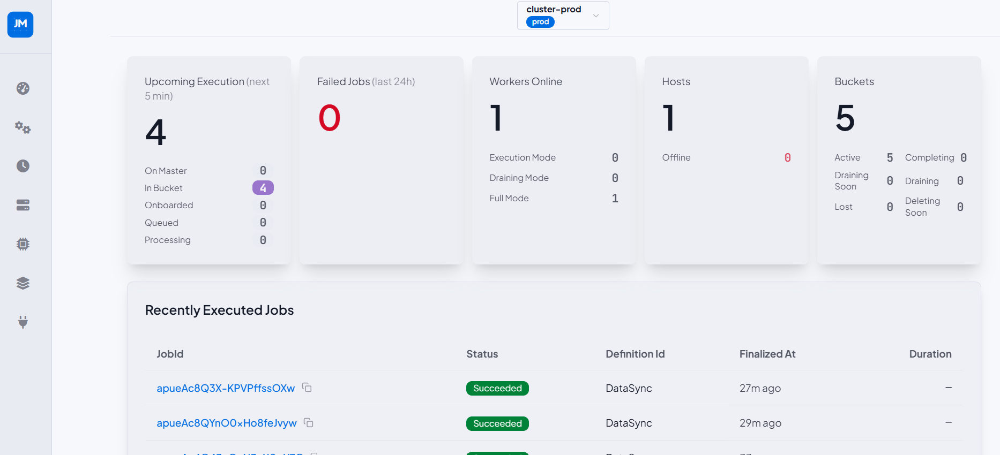

---

## Cluster and Theme Selector

Dropdown panel for switching between registered clusters and toggling the UI theme.
Each cluster displays its configured environment badge (`prod`, `qa`, `dev`).

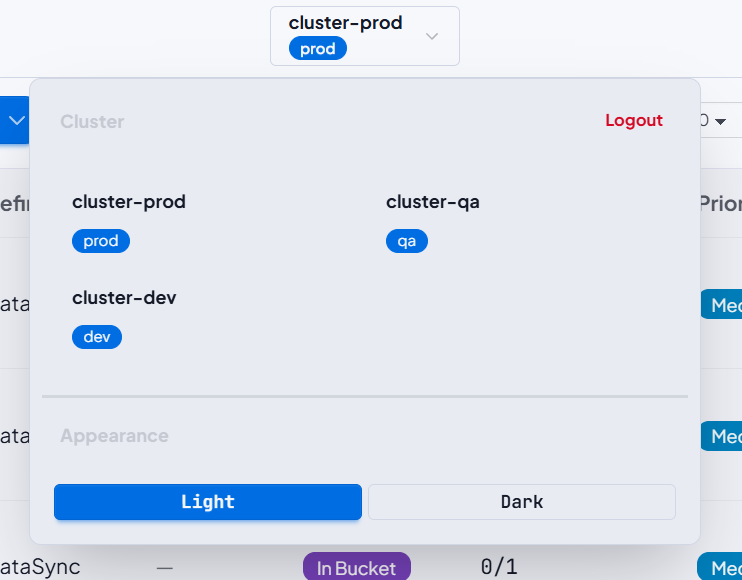

---

## Sidebar Navigation

Left navigation rail with links to all sections: Dashboard, Jobs, Recurring Schedules, Hosts, Workers, Buckets, Agent Connections. The JM logo at the top links back to the cluster overview.

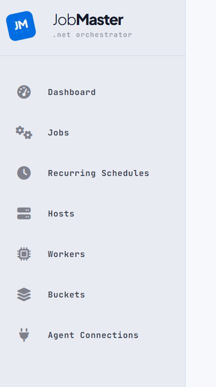

---

## Jobs List

Paginated job browser with filtering by status and scheduled-at time range, sorting, and configurable page size. Each row shows job ID, definition ID, metadata, status badge, failure attempts, priority, schedule date, next planned execution, finish time, worker lane, and assigned bucket. Completed jobs show a `Succeeded` badge with no bucket reference; in-flight jobs show `In Bucket` with a link to their assigned bucket.

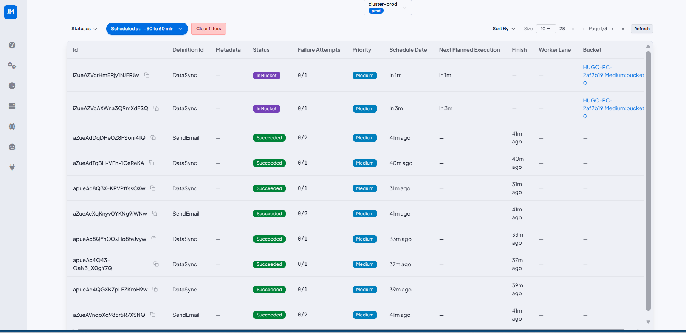

---

## Job Detail

Full detail view for a single job, reached via breadcrumb from the Jobs list. Divided into four cards:

- **Summary** — ID, definition ID, status badge, priority, scheduled date, created at.
- **Infrastructure** — bucket, agent connection, worker, host (linked), worker lane, and trigger source (e.g. `Dynamic Recurring`).
- **Message Data** — raw JSON payload passed to the handler.
- **Metadata** — key/value pairs attached to the job at scheduling time. Displays "No metadata." when none were provided.
- **Failure & Retries** — number of failures, max retries allowed, and individual retry execution records with timestamps and error details.
- **Logs** — structured log entries emitted by the handler during execution, shown in chronological order with level, category, and message.

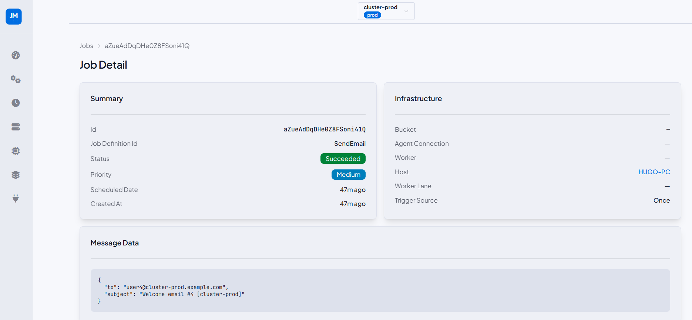

---

## Recurring Schedules List

Paginated list of all recurring schedules registered in the cluster. Columns: ID, job definition ID, recurrence expression, status badge, worker lane, metadata, start after, and end before. Filterable by status and creation date.

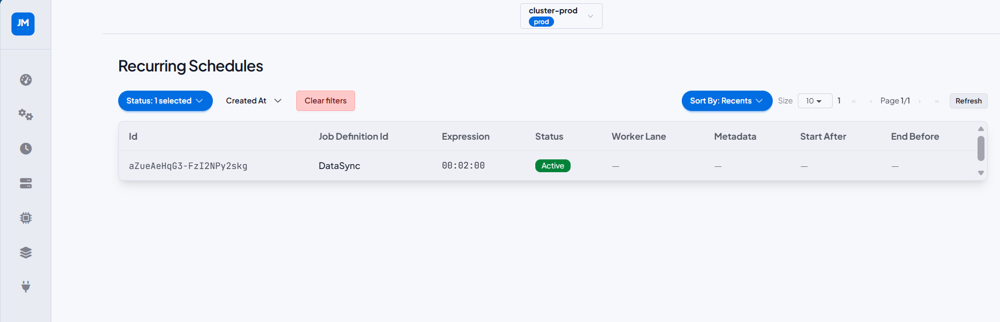

---

## Recurring Schedule Detail

Full detail view for a single recurring schedule. Shows the **Details** card (description, expression, timezone, job definition, status) alongside **Message Data** and **Metadata** cards. The **Upcoming Runs** table lists the next scheduled job instances with their status (`Onboarded`, `In Bucket`, `Succeeded`), scheduled-at time, and priority.

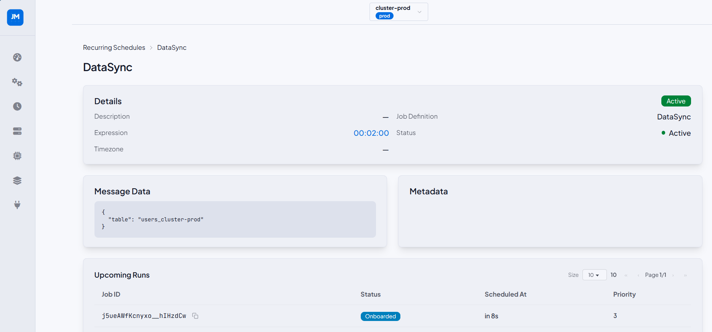

---

## Hosts List

Cluster-level summary of all registered hosts with aggregate stat cards: Hosts Online, Hosts Offline, Avg. CPU Usage, Avg. Memory Usage. The table lists each host with its status, CPU load, memory usage, worker count, and uptime.

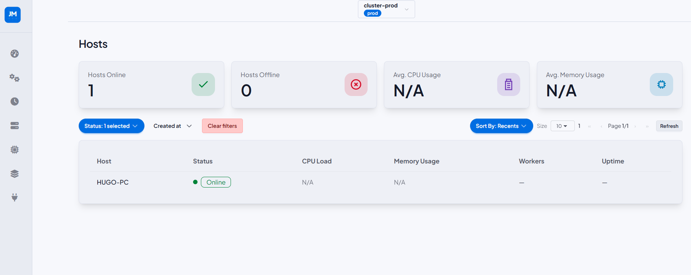

---

## Host Detail

Detail view for a single host showing online status badge, CPU Usage, and Memory Usage metric cards. The **Workers Assigned** table lists all workers running on that host with their worker lane and status.

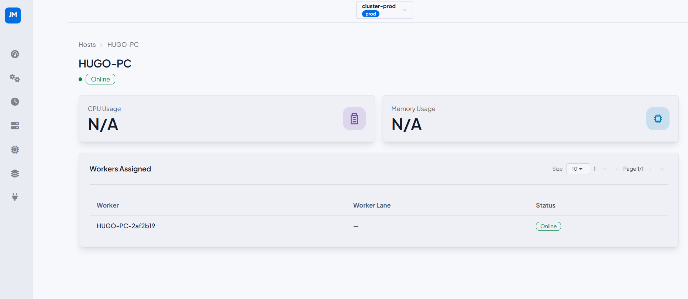

---

## Workers List

Cluster-level summary of all agent workers. Stat cards show Workers Online and Workers Offline. The table lists each worker with status, mode (`Full`, `Execution`, `Drain`), host, lane, and last heartbeat timestamp. Filterable by status and mode.

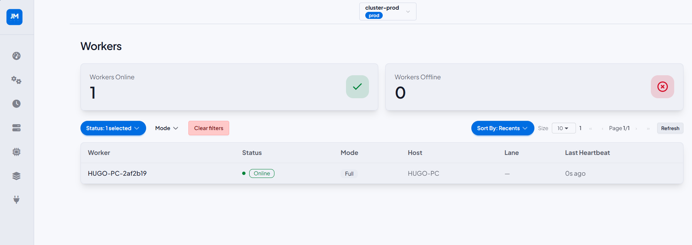

---

## Worker Detail

Detail view for a single worker showing online status, and a **Configuration** card (mode, agent connection, lane, host, parallelism factor, last heartbeat). The **Buckets** table lists all buckets owned by this worker with their agent connection, worker lane, host, creation time, and status.

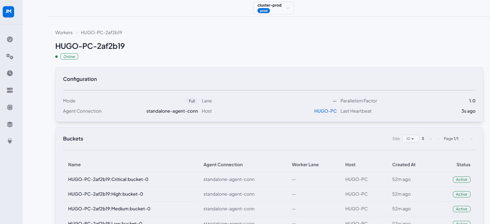

---

## Buckets List

Cluster-level bucket summary with stat cards: Total Buckets, Active, Lost, and Draining. The table lists each bucket by name, agent connection, worker lane, host, creation time, and status badge. Filterable by status and creation date.

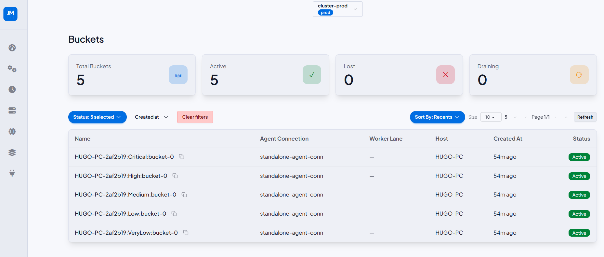

---

## Bucket Detail

Detail view for a single bucket showing its status badge and a **Details** card (host, agent connection, worker, worker lane, created at, last status change). The **Active Jobs** table shows currently processing jobs with their definition, state, scheduled-at time, queue time, and run duration.

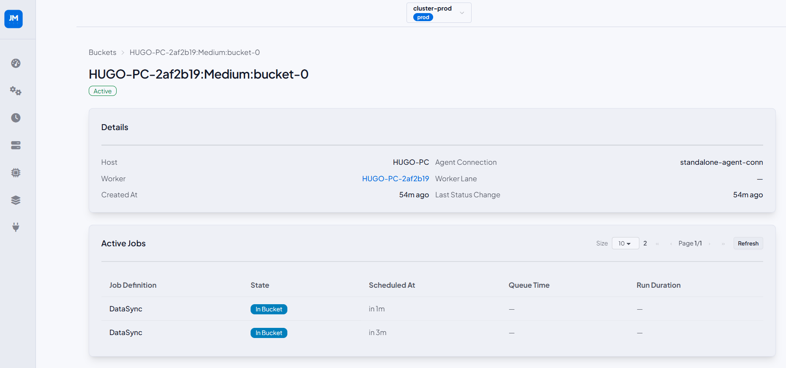

---

## Agent Connections List

Lists all agent connections in the cluster. Columns: name, repository type, health badge (`OK`), last heartbeat, and created at. Filterable by health status.

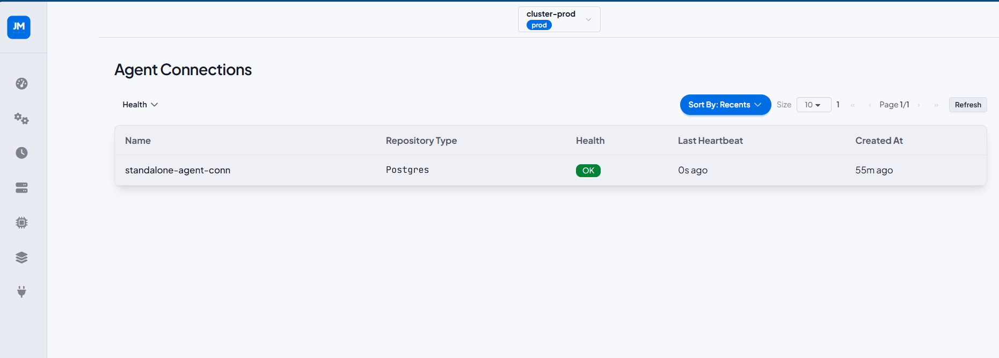

---

## Agent Connection Detail

Detail view for a single agent connection showing health status badge and a **Details** card (repository type, last heartbeat, created at, protect changes flag). The **Workers** table lists all workers registered under this connection with their mode, worker lane, status, and last heartbeat.

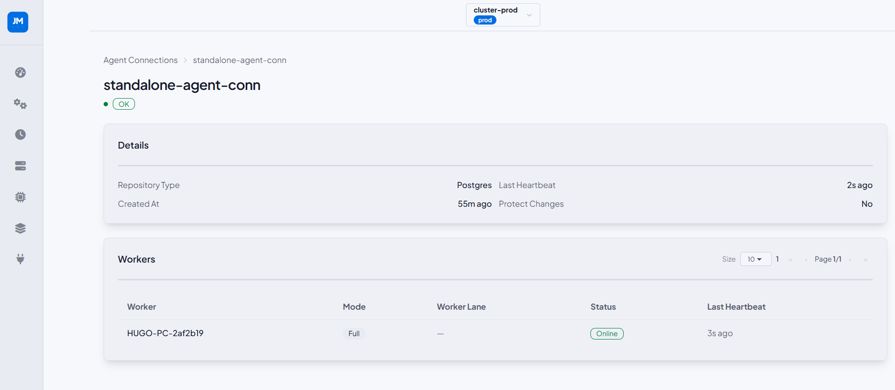
